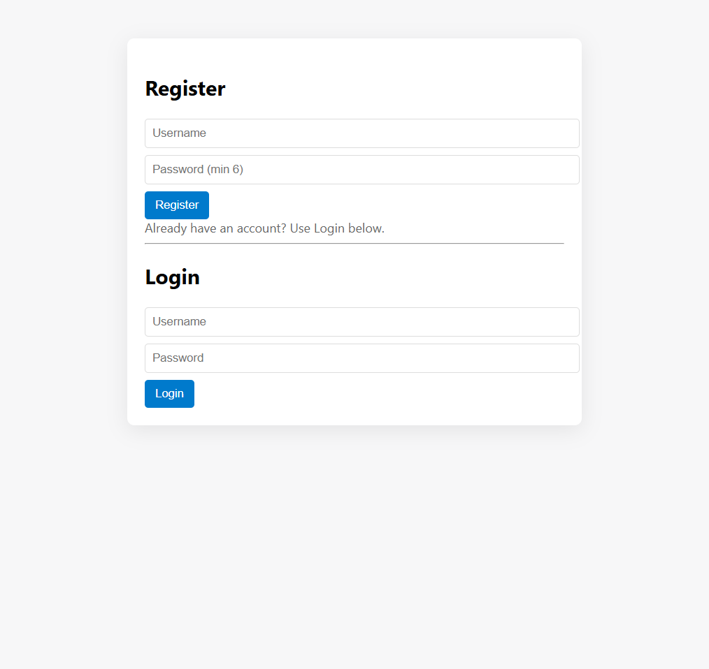
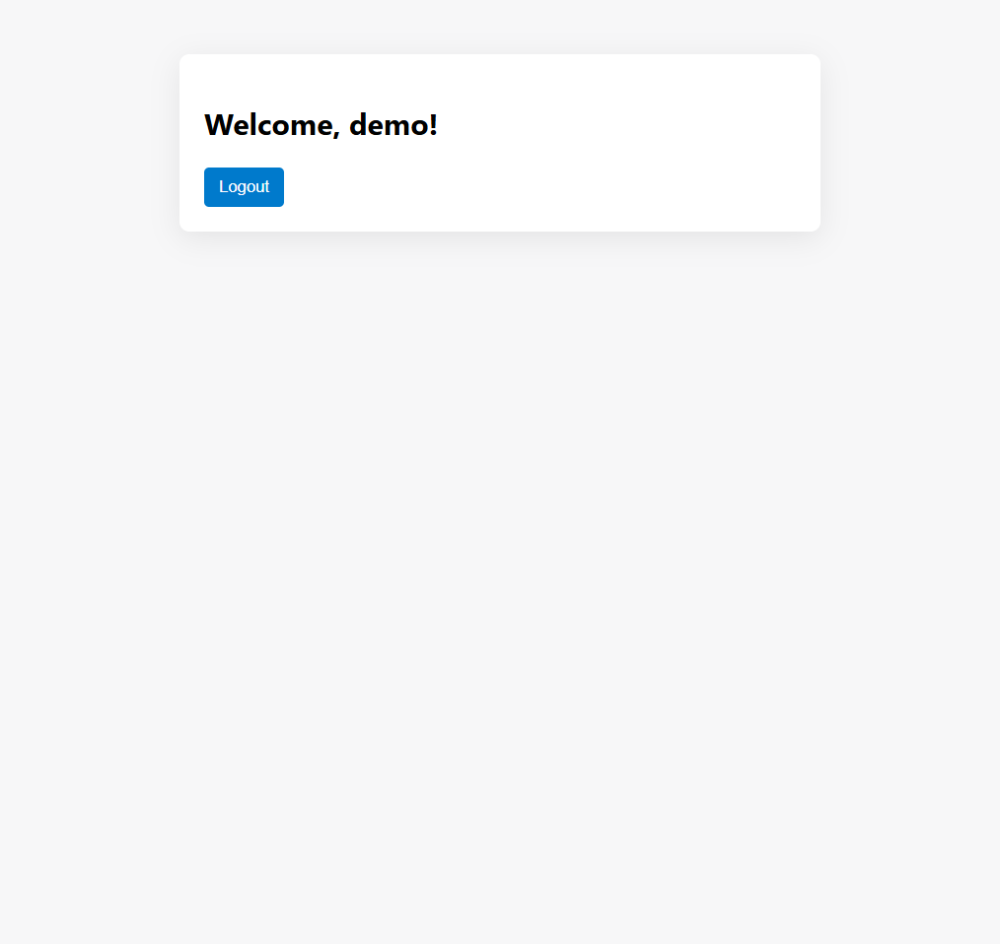

# Minimal Auth Demo

Small Express and SQLite app with register, login, session handling, logout, and a simple single-page UI.

## Run

```bash
npm install
npm start
```

The app runs at `http://localhost:3000`.

## Project Files

- `server.js` - Express server and API routes
- `public/index.html` - Frontend UI
- `check.js` - Helper script to inspect the SQLite database
- `connect.js` - Helper script to inspect the SQLite database
- `mydb.db` - Local SQLite database

## Screenshots

Auth screen:



Logged-in screen:



## Notes

- The database is stored inside the `LAB-1` folder so the app and helper scripts use the same file.
- If you want a clean start, delete `mydb.db` and restart the server.